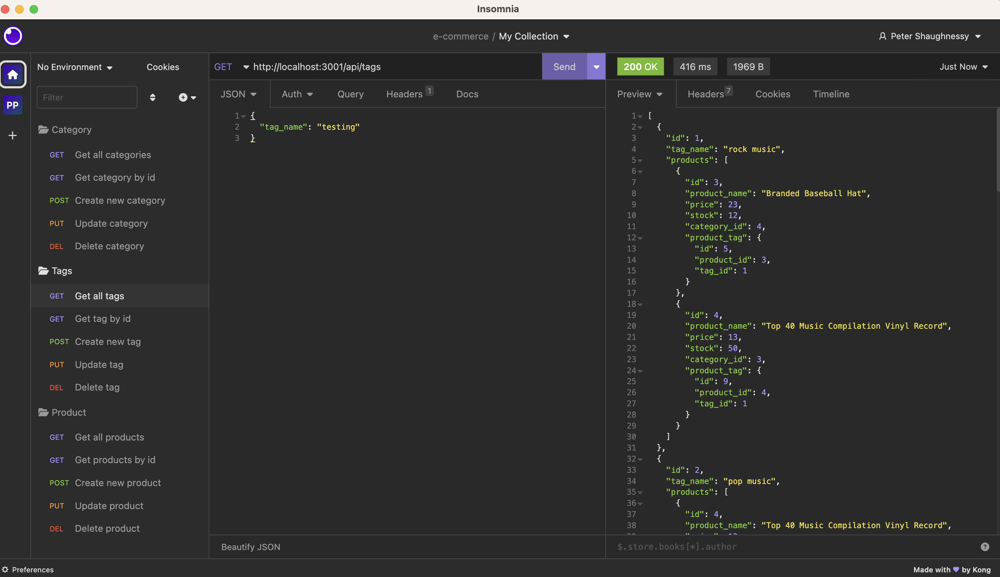

### E-Commerce Back-end
___
#### Description
____
 A project to allow for the back-end functionality of an e-commerce website. The application uses Express.js API's along with Sequelize to interact with a MySQL database
 ____

 #### Table of Contents
 * Installation
 * Usage
 * Mock-ups
  _____
  ##### Installation
  User begins by cloning the repository from GitHub. Node.js, Express.js and Sequelize will all need to be added via the npm install command. Navigate to MySQL using the mysql -u root -p command and enter password. From there, add the included schema.sql.
  After exiting mysql, the seeds.js folders can be added running npm run seed. The npm start command will initiate the connection to the server.

  ____
  ##### Usage
  Once connected, the application will allow users to view, add, update, and delete categories, products and tags.
  A walk though video of the application can be seen here; [Screencastify](https://drive.google.com/file/d/11aWgIClEXmuzuAIdqwACt3UhWPi9R1sS/view)
  ____
  ##### Mock-ups

  

  

  

